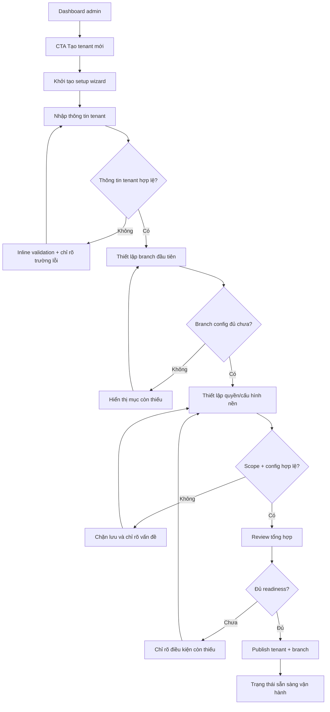
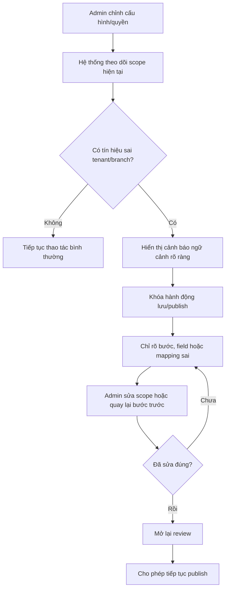
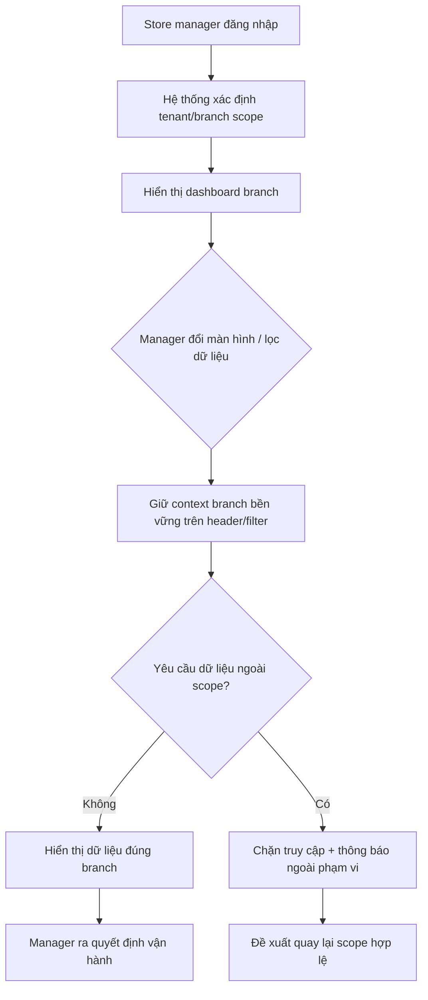

---
stepsCompleted:
  - 1
  - 2
  - 3
  - 4
  - 5
  - 6
  - 7
  - 8
  - 9
  - 10
  - 11
  - 12
  - 13
  - 14
lastStep: 14
inputDocuments:
  - "_bmad-output/planning-artifacts/prd.md"
  - "_bmad-output/planning-artifacts/product-brief-POS_BlueCoral.md"
---

# UX Design Specification POS_BlueCoral

**Author:** Hung
**Date:** 2026-05-12

---

<!-- UX design content will be appended sequentially through collaborative workflow steps -->

## Executive Summary

### Project Vision

POS_BlueCoral cần mang lại một trải nghiệm quản trị POS multi-tenant nơi system admin nội bộ luôn hiểu rõ mình đang thao tác trong tenant, branch và scope quyền nào. Giá trị UX cốt lõi không nằm ở giao diện phức tạp hay nhiều tùy chọn, mà ở cảm giác kiểm soát chắc chắn: cấu hình đúng phạm vi, guardrails rõ ràng, và giảm tối đa khả năng tạo sai lệch vận hành ngay từ bước thiết lập. Trải nghiệm V1 vì vậy nên ưu tiên sự minh bạch về scope, sự an toàn khi cấu hình, và độ mạch lạc của các flow back-office trên desktop.

### Target Users

Người dùng UX ưu tiên ở V1 là **system admin nội bộ** làm việc chủ yếu trên **desktop trong môi trường back-office**. Họ chịu trách nhiệm tạo tenant, branch, cấu hình nền và kiểm soát quyền truy cập liên quan. Bên cạnh đó, store manager và staff/cashier vẫn là các nhóm người dùng quan trọng ở tầng vận hành, nhưng ở giai đoạn này UX cần đặc biệt phục vụ nhu cầu của admin: nhìn rõ ngữ cảnh, kiểm soát quyền và cấu hình liên quan, và tự tin rằng hệ thống đang bảo vệ họ khỏi thao tác sai phạm vi.

### Key Design Challenges

1. Làm cho tenant, branch và quyền truy cập luôn hiện diện rõ trong các màn hình quản trị mà không gây rối mắt hoặc tăng tải nhận thức.
2. Giúp system admin kiểm soát quyền và cấu hình liên quan theo cách dễ hiểu, dễ rà soát và khó tạo sai lệch lan sang tenant hoặc branch khác.
3. Cân bằng giữa sức mạnh quản trị và độ an toàn thao tác: flow phải đủ nhanh cho công việc thực tế nhưng vẫn có guardrails, xác nhận ngữ cảnh và tín hiệu cảnh báo ở đúng chỗ.

### Design Opportunities

1. Biến “scope awareness” thành một lợi thế UX rõ ràng thông qua các tín hiệu ngữ cảnh bền vững, trạng thái hiện tại dễ quét và cấu trúc màn hình nhất quán.
2. Thiết kế các flow cấu hình tenant/branch và phân quyền như các luồng có bảo hiểm rủi ro: xem trước phạm vi ảnh hưởng, xác nhận theo ngữ cảnh và giảm khả năng thao tác nhầm.
3. Tạo một trải nghiệm admin mang cảm giác bình tĩnh và đáng tin cậy, nơi độ phức tạp hệ thống được hấp thụ bởi cấu trúc giao diện thay vì đẩy sang người vận hành.

## Core User Experience

### Defining Experience

Core experience của POS_BlueCoral trong giai đoạn đầu xoay quanh việc **system admin nội bộ thiết lập tenant và branch mới đúng scope, đủ nhanh, và đủ chắc chắn để có thể đưa vào vận hành ngay sau setup**. Trải nghiệm này không nên giống một màn hình cấu hình dày đặc tùy chọn, mà nên giống một flow quản trị có dẫn hướng rõ: admin luôn biết mình đang ở đâu, đang cấu hình cho ai, bước nào còn thiếu, và điều gì sẽ xảy ra sau khi lưu. Nếu flow này được làm đúng, toàn bộ cảm nhận về tính an toàn và tính trưởng thành của sản phẩm sẽ được thiết lập ngay từ lần dùng đầu.

### Platform Strategy

Nền tảng ưu tiên cho core experience này là **web app desktop**, tối ưu cho **mouse + keyboard** trong môi trường back-office. Điều này cho phép UX tận dụng layout giàu thông tin hơn, panel ngữ cảnh rõ hơn, breadcrumb/scope indicator bền vững hơn, và các thao tác rà soát cấu hình trước khi lưu. Vì trọng tâm là thiết lập chính xác hơn là thao tác di động, desktop-first là chiến lược phù hợp nhất cho flow quản trị tenant/branch ở V1.

### Effortless Interactions

Những tương tác cần trở nên gần như effortless gồm:
- Đi qua flow tạo tenant/branch theo từng bước rất rõ, không cần tự suy đoán thứ tự.
- Nhìn thấy context tenant/branch hiện tại ngay trong suốt quá trình cấu hình.
- Biết bước nào đã hoàn tất, bước nào còn thiếu, và điều kiện nào chặn việc đưa tenant/branch vào vận hành.
- Được hệ thống hỗ trợ kiểm tra logic cơ bản để giảm nhu cầu kiểm tra chéo thủ công.

### Critical Success Moments

Khoảnh khắc thành công quan trọng nhất là khi **tenant/branch mới sẵn sàng vận hành ngay sau setup**, và admin có thể tin rằng cấu hình nền, scope và các thiết lập chính đã được hoàn tất đúng chỗ. Ngược lại, khoảnh khắc phá hỏng trải nghiệm là khi admin phải tự nghi ngờ liệu mình vừa cấu hình đúng tenant, đúng branch hay chưa, hoặc còn thiếu điều kiện nào để go-live.

### Experience Principles

- **Scope luôn hiển thị, không bao giờ phải suy đoán.**
- **Thiết lập theo luồng dẫn hướng, không dựa vào trí nhớ của admin.**
- **An toàn vận hành phải được tích hợp vào flow, không phải bước kiểm tra thủ công sau cùng.**
- **Mỗi bước cấu hình phải tiến gần hơn tới trạng thái “sẵn sàng vận hành”, không chỉ là điền form.**

## Desired Emotional Response

### Primary Emotional Goals

Cảm xúc chính mà POS_BlueCoral nên tạo ra cho system admin nội bộ là **bình tĩnh và kiểm soát tốt**. Trong một bài toán có nhiều scope, quyền và cấu hình liên quan, UX không nên làm người dùng thấy mình đang “chạy đua với hệ thống”, mà phải khiến họ cảm thấy mình đang điều khiển một quy trình rõ ràng, an toàn và có thể dự đoán được. Cảm xúc hỗ trợ quan trọng là sự tự tin: admin tin rằng hệ thống đang giúp họ làm đúng, chứ không bắt họ tự phòng thủ trước rủi ro sai phạm vi.

### Emotional Journey Mapping

- **Khi bắt đầu flow:** admin nên cảm thấy rõ ràng và được định hướng, không bị choáng bởi cấu hình.
- **Trong lúc thao tác:** admin nên cảm thấy bình tĩnh, theo kịp tiến trình và biết chính xác scope hiện tại.
- **Khi gần hoàn tất:** admin nên cảm thấy tự tin rằng các bước quan trọng đã được hệ thống kiểm soát tốt.
- **Sau khi hoàn tất:** admin nên cảm thấy **sẵn sàng đưa tenant/branch vào vận hành** ngay, thay vì phải mở thêm nhiều màn hình để tự xác minh.
- **Khi có lỗi hoặc thiếu bước:** hệ thống nên giữ cảm giác hỗ trợ và định hướng, không tạo cảm giác bị trách phạt hoặc mất kiểm soát.

### Micro-Emotions

Micro-emotion quan trọng nhất cần ưu tiên là **confidence thay vì confusion**. Điều này có nghĩa là mỗi bước cần trả lời nhanh các câu hỏi ngầm của admin: tôi đang cấu hình cho ai, bước này ảnh hưởng gì, còn thiếu gì, và nếu lưu thì chuyện gì sẽ xảy ra. Các cảm xúc phụ cần được nuôi dưỡng gồm trust, calm và accomplishment; các cảm xúc cần tránh là nghi ngờ, lo lắng âm ỉ và cảm giác phải tự kiểm tra chéo toàn bộ flow.

### Design Implications

- **Bình tĩnh và kiểm soát tốt** → dùng cấu trúc step-by-step, hierarchy thông tin rõ, trạng thái tiến trình dễ quét.
- **Tự tin** → hiển thị scope tenant/branch bền vững, cung cấp preview và xác nhận theo ngữ cảnh trước các hành động quan trọng.
- **Sẵn sàng vận hành** → kết thúc flow bằng trạng thái hoàn tất rõ ràng, chỉ ra tenant/branch đã đạt điều kiện go-live nào và còn thiếu gì nếu có.
- Các tương tác cần tránh gồm form dày đặc, nhãn mơ hồ, trạng thái thiếu phản hồi và các quyết định có hậu quả lớn nhưng không cho thấy phạm vi ảnh hưởng.

### Emotional Design Principles

- **Thiết kế để giảm lo âu vận hành, không chỉ để hoàn tất tác vụ.**
- **Mỗi bước phải tăng cảm giác chắc chắn, không tăng nghi ngờ.**
- **Thông tin ngữ cảnh phải nuôi dưỡng self-confidence của admin.**
- **Trạng thái hoàn tất phải tạo cảm giác sẵn sàng hành động, không chỉ “đã lưu thành công”.**

## UX Pattern Analysis & Inspiration

### Inspiring Products Analysis

**Linear** gợi ý một hướng UX mạnh cho POS_BlueCoral ở cách tổ chức hierarchy, trạng thái và tốc độ flow. Linear cho cảm giác mọi thứ đều có chỗ đứng rõ ràng, ít nhiễu, nhưng vẫn cho phép người dùng hiểu nhanh mình đang ở đâu và bước tiếp theo là gì. Điều này rất phù hợp với nhu cầu của system admin khi thiết lập tenant/branch theo một flow có guardrails.

**Stripe Dashboard** là nguồn cảm hứng mạnh về cách xử lý các bối cảnh quản trị quan trọng mà vẫn giữ được sự tin cậy. Stripe thường làm tốt ở việc hiển thị thông tin giàu ngữ cảnh, phân tầng rõ giữa overview, chi tiết và hành động có hệ quả. Đây là pattern phù hợp cho các tác vụ cấu hình quyền, branch và tenant — nơi người dùng cần cảm giác kiểm soát, không chỉ tốc độ.

**Vercel** mang lại cảm hứng về nhịp độ thao tác nhanh, phản hồi trạng thái tốt và cảm giác sản phẩm “nhẹ” dù xử lý các concern kỹ thuật khá nặng. Với POS_BlueCoral, bài học quan trọng là có thể thiết kế một back-office admin experience giàu thông tin mà vẫn tạo cảm giác mượt, sáng sủa và không đè nặng lên nhận thức.

### Transferable UX Patterns

**Navigation Patterns**
- Sidebar hoặc information architecture phân tầng rõ, cho phép admin hiểu nhanh nhóm tác vụ nào thuộc tenant setup, branch setup, quyền và review.
- Persistent context header/breadcrumb để luôn thấy tenant, branch và bước hiện tại mà không cần nhớ bằng đầu.

**Interaction Patterns**
- Wizard hoặc setup flow nhiều bước với trạng thái tiến trình rõ, tương tự cách các sản phẩm tốt dẫn người dùng qua một chuỗi quyết định có hệ quả.
- Review step trước khi hoàn tất, giúp admin thấy toàn bộ phạm vi ảnh hưởng và điều kiện go-live.
- Inline validation và trạng thái phản hồi nhanh để tránh việc chỉ phát hiện lỗi ở cuối flow.

**Visual Patterns**
- Bề mặt sạch, giảm chrome không cần thiết, ưu tiên khoảng trắng và hierarchy rõ để hỗ trợ cảm giác bình tĩnh.
- Dùng typographic contrast và trạng thái màu có chủ đích để nhấn vào scope, mức độ hoàn tất và các cảnh báo quan trọng.

### Anti-Patterns to Avoid

- Màn hình cấu hình dồn quá nhiều field và quyết định vào một nơi, khiến admin phải tự tách nghĩa và tự nhớ scope.
- Context tenant/branch chỉ xuất hiện lúc đầu hoặc quá nhỏ, dẫn tới nguy cơ thao tác “đúng form nhưng sai phạm vi”.
- Error handling chỉ xuất hiện sau khi submit, khiến người dùng mất cảm giác kiểm soát.
- Giao diện tối ưu cho “đủ tính năng” nhưng không tối ưu cho tiến trình, khiến flow setup bị ngắt mạch.

### Design Inspiration Strategy

**What to Adopt**
- Hierarchy rõ, trạng thái rõ và nhịp flow nhanh từ Linear.
- Cách trình bày dữ liệu quản trị quan trọng với độ tin cậy cao từ Stripe Dashboard.
- Cảm giác nhẹ, phản hồi tốt và cleanliness của Vercel.

**What to Adapt**
- Adapt các pattern dashboard nhiều thông tin thành một flow setup có dẫn hướng rõ hơn cho bài toán tenant/branch.
- Adapt các trạng thái/progress pattern để nhấn mạnh readiness và scope safety, không chỉ completion.

**What to Avoid**
- Tránh biến admin UX thành một dashboard generic thiếu tiến trình.
- Tránh vay mượn trực tiếp aesthetic mà bỏ qua bài toán vận hành và độ an toàn theo scope của POS multi-tenant.

## Design System Foundation

### 1.1 Design System Choice

POS_BlueCoral sẽ đi theo hướng **themeable design system** với **shadcn/ui** làm nền component strategy ban đầu cho web app desktop admin. Lựa chọn này phù hợp với giai đoạn hiện tại vì sản phẩm cần một nền tảng UI đủ nhanh để triển khai, nhưng vẫn cho phép tạo ra visual identity và interaction style riêng cho một trải nghiệm quản trị có tính an toàn vận hành cao.

### Rationale for Selection

- shadcn/ui cho phép giữ được tốc độ build nhờ các primitive và component pattern sẵn có, nhưng không khóa sản phẩm vào một visual language quá generic.
- Nhu cầu của POS_BlueCoral không phải chỉ là dựng dashboard nhanh, mà là tạo một trải nghiệm back-office có hierarchy rõ, scope awareness mạnh và tone đáng tin cậy; shadcn/ui hỗ trợ tốt cho mức tùy biến này.
- Với định hướng desktop-first cho system admin, sản phẩm cần các layout, panel, step flow và status treatment có thể tinh chỉnh sâu hơn để phản ánh readiness, tenant/branch context và guardrails theo scope.
- Lý do ưu tiên chính từ phía bạn là **dễ tùy biến visual identity**, và shadcn/ui đáp ứng điều đó tốt hơn các hệ thống mang dấu ấn thị giác mặc định mạnh hơn.

### Implementation Approach

- Dùng shadcn/ui như nền component primitives cho các thành phần cốt lõi: button, input, select, dialog, sheet, table, tabs, badge, toast và form patterns.
- Xây thêm một layer POS_BlueCoral-specific patterns phía trên: setup wizard stepper, scope header, readiness checklist, review panel, risk alert và permission/config summary blocks.
- Chuẩn hóa sớm token về màu, typography, spacing, radius, elevation và status semantics để giữ consistency xuyên suốt các flow quản trị.
- Ưu tiên trước các component phục vụ flow tạo tenant/branch và kiểm soát quyền/cấu hình, thay vì cố bao phủ toàn bộ design system ngay từ đầu.

### Customization Strategy

- Tùy biến visual language theo hướng sạch, sáng, giàu hierarchy và tạo cảm giác bình tĩnh/kiểm soát.
- Dùng color semantics một cách có chủ đích để phân biệt trạng thái an toàn, cảnh báo, thiếu bước và sẵn sàng vận hành.
- Thiết kế pattern library nội bộ cho các yếu tố “scope-aware” thay vì chỉ tùy biến bề mặt component cơ bản.
- Giữ primitive layer đơn giản, còn sự khác biệt cạnh tranh nằm ở interaction patterns và orchestration của flow admin.

## 2. Core User Experience

### 2.1 Defining Experience

Defining experience của POS_BlueCoral là: **system admin bắt đầu từ một CTA “Tạo tenant mới” rất rõ, đi qua một flow setup tập trung, có dẫn hướng, và đưa tenant + branch đầu tiên tới trạng thái sẵn sàng vận hành mà không phải mở nhiều màn hình rời rạc để tự ghép logic**. Nếu trải nghiệm này được làm đúng, người dùng sẽ mô tả sản phẩm không phải như “một dashboard admin khác”, mà là một hệ thống giúp họ setup tenant/branch đúng scope ngay từ đầu với cảm giác chắc tay và ít phải suy đoán.

### 2.2 User Mental Model

Hiện tại mental model của admin thường bị chi phối bởi các hệ thống có **nhiều màn hình rời rạc**: tạo tenant ở một nơi, tạo branch ở nơi khác, quyền và cấu hình ở thêm các nơi khác nữa. Điều đó buộc họ phải tự nhớ thứ tự, tự kiểm tra chéo và tự suy luận xem hệ thống đã đủ điều kiện go-live hay chưa. Với POS_BlueCoral, mental model cần được chuyển thành một flow thống nhất hơn: “tôi đang onboarding một tenant”, chứ không phải “tôi đang ghép nhiều màn hình quản trị thành một quy trình”.

### 2.3 Success Criteria

- Admin có thể bắt đầu flow từ dashboard bằng một điểm vào rõ ràng, không cần tìm kiếm.
- Mỗi bước trong flow cho thấy rõ đang cấu hình gì, thuộc tenant/branch nào, và bước nào còn thiếu.
- Hệ thống gom các quyết định cốt lõi vào một tiến trình mạch lạc thay vì bắt admin nhảy giữa nhiều màn hình.
- Admin nhận được feedback liên tục rằng mình đang đi đúng hướng.
- Kết thúc flow, admin biết tenant/branch đã sẵn sàng vận hành hay còn thiếu điều kiện nào.

### 2.4 Novel UX Patterns

POS_BlueCoral không cần một interaction hoàn toàn mới; hướng phù hợp hơn là **kết hợp các pattern quen thuộc nhưng tổ chức lại thông minh hơn**. Các pattern như wizard nhiều bước, progress state, review summary và contextual validation đều đã quen với người dùng admin. Điểm khác biệt của POS_BlueCoral nằm ở cách kết hợp chúng thành một flow onboarding tenant/branch có awareness rất mạnh về scope, readiness và guardrails. Nói cách khác, innovation nằm ở orchestration của experience chứ không nằm ở việc bắt người dùng học một ngôn ngữ tương tác mới.

### 2.5 Experience Mechanics

**1. Initiation**
- Người dùng bắt đầu từ nút **“Tạo tenant mới”** rất rõ trên dashboard.
- CTA này đóng vai trò lời mời vào một flow có cấu trúc, không chỉ mở ra một form trống.

**2. Interaction**
- Admin đi qua các bước theo thứ tự hợp lý: thông tin tenant, branch đầu tiên, quyền/cấu hình nền, review.
- Mỗi bước đều có context header bền vững, trạng thái tiến trình và validation theo ngữ cảnh.
- Hệ thống giảm nhu cầu chuyển trang hoặc mở thêm khu vực quản trị khác.

**3. Feedback**
- Mỗi bước cho biết đã hoàn tất hay chưa, còn thiếu gì và vì sao.
- Khi có lỗi, thông điệp phải chỉ rõ vấn đề nằm ở bước nào và ảnh hưởng đến readiness ra sao.
- Review step tổng hợp phạm vi ảnh hưởng trước khi hoàn tất.

**4. Completion**
- Khi hoàn tất, người dùng thấy trạng thái rõ rằng tenant và branch đầu tiên đã đạt mức sẵn sàng vận hành.
- Nếu còn thiếu điều kiện, hệ thống phải chỉ ra rõ những việc tiếp theo thay vì chỉ báo “lưu thành công”.

## Visual Design Foundation

### Color System

Vì chưa có brand guideline cố định, visual foundation của POS_BlueCoral nên đi theo một bảng màu mới mang cảm giác **chuyên nghiệp, hiện đại, bình tĩnh** và hỗ trợ tốt cho UX quản trị an toàn theo scope.

- **Primary:** xanh dương sâu / blue-slate để tạo cảm giác tin cậy, ổn định và kiểm soát.
- **Secondary / Accent:** xanh coral-teal nhẹ để gợi cảm giác hiện đại và tạo điểm nhấn tinh tế cho các trạng thái tích cực hoặc highlight hành động.
- **Neutral system:** dải slate/gray sạch và cân bằng để làm nền cho dashboard, form, panel và bảng dữ liệu.
- **Semantic colors:**
  - Success: xanh lá dịu nhưng rõ cho trạng thái sẵn sàng vận hành.
  - Warning: amber ấm cho thiếu bước hoặc rủi ro cần chú ý.
  - Error: đỏ rõ ràng nhưng không gắt cho lỗi chặn.
  - Info: xanh dương trung tính cho guidance và contextual support.

Color system cần ưu tiên semantic clarity hơn trang trí. Scope, readiness và risk cần được phân biệt bằng màu một cách có chủ đích, không lạm dụng màu bão hòa mạnh.

### Typography System

- **Primary typeface:** sans-serif hiện đại như Inter hoặc Geist để giữ cảm giác clean, rõ và phù hợp desktop admin.
- **Tone typographic:** rõ hierarchy, ít kiểu cách, ưu tiên readability hơn cá tính thị giác.
- **Hierarchy:**
  - Heading lớn cho page title và step title
  - Subheading rõ cho section logic
  - Body text tối ưu cho form, help text, trạng thái và bảng dữ liệu
  - Label/supporting text phải đủ tương phản và không bị “mất” trong layout admin
- Cỡ chữ nên ưu tiên khả năng quét nhanh trong back-office; line-height vừa phải để giữ màn hình gọn nhưng không ngột ngạt.

### Spacing & Layout Foundation

- Layout nên **cân bằng giữa thoáng và hiệu quả**, không quá dense nhưng cũng không quá trống.
- **Base spacing:** hệ 8px là phù hợp nhất cho desktop admin vì dễ scale từ component nhỏ đến layout lớn.
- **Grid:** 12-column responsive grid cho các màn hình chính, kết hợp panel/card structure cho flow setup và review.
- **Layout principles:**
  - Ưu tiên sectioning rõ theo task và progress.
  - Dành vùng hiển thị nổi bật cho context header và step progress.
  - Tạo rhythm nhất quán giữa form fields, summary blocks, alerts và review sections.

### Accessibility Considerations

- Ưu tiên contrast đủ mạnh cho text, label, badge trạng thái và semantic colors.
- Không phụ thuộc chỉ vào màu để truyền đạt scope hoặc lỗi; luôn có icon/text hỗ trợ.
- Form controls, focus states và validation states cần rõ ràng cho thao tác mouse + keyboard.
- Typography và spacing phải hỗ trợ quét nhanh, giảm nhầm lẫn trong các flow cấu hình nhiều bước.

## Design Direction Decision

### Design Directions Explored

POS_BlueCoral đã khám phá 6 hướng thiết kế cho flow admin tạo tenant/branch mới: một hướng linear dẫn hướng mạnh, một hướng control panel thiên về governance, một hướng tech-lightweight hiện đại, một hướng calm workspace, một hướng dense power-user, và một hướng review-first tập trung readiness. Các hướng này khác nhau chủ yếu ở mức độ visual weight, cách ưu tiên progress/readiness, mức độ density và cấu trúc navigation/panel.

### Chosen Direction

Hướng được chọn là **Direction 01 — Guided Linear Flow**. Đây là một direction ưu tiên hierarchy rõ, tiến trình dễ quét, điểm vào hành động rõ ràng và nhịp thao tác mạch lạc cho admin. Direction này hỗ trợ rất tốt defining experience đã thống nhất trước đó: bắt đầu bằng CTA “Tạo tenant mới”, đi qua flow nhiều bước có dẫn hướng, và đạt trạng thái sẵn sàng vận hành mà không phải tự ghép nhiều màn hình rời rạc.

### Design Rationale

- Direction 01 phù hợp nhất với mục tiêu cốt lõi là giảm tải nhận thức và làm cho setup tenant/branch trở thành một tiến trình rõ ràng.
- Hướng này hỗ trợ tốt cảm xúc mong muốn: bình tĩnh, kiểm soát tốt và tự tin.
- So với các hướng nặng control hơn, Direction 01 ít tạo cảm giác dashboard phức tạp; so với các hướng quá nhẹ, nó vẫn giữ đủ chỗ cho scope awareness, progress và readiness.
- Việc giữ Direction 01 làm nền cũng giúp đội thiết kế và triển khai nhất quán hơn với component strategy trên shadcn/ui.

### Implementation Approach

- Dùng Direction 01 làm north star cho layout của flow setup tenant/branch.
- Giữ cấu trúc: CTA khởi tạo rõ trên dashboard, wizard nhiều bước, context header bền vững, readiness panel bên cạnh và review step trước khi hoàn tất.
- Khi đi vào chi tiết màn hình, có thể vay mượn chọn lọc một số treatment readiness/review từ các direction khác, nhưng không làm mất tính linear-guided là trọng tâm.
- Mọi màn hình về sau nên được kiểm tra lại theo câu hỏi: có giúp admin biết mình đang ở đâu, còn thiếu gì, và đã đủ sẵn sàng vận hành chưa?

## User Journey Flows

### Journey 1 — System admin tạo tenant + branch mới đúng scope

Mục tiêu của flow này là đưa admin từ dashboard vào một tiến trình tạo tenant/branch rõ ràng, giữ được context xuyên suốt và kết thúc bằng trạng thái sẵn sàng vận hành.

### Journey 2 — System admin phát hiện/ngăn sai tenant hoặc sai branch trước khi lưu

Flow này bảo vệ admin khỏi failure mode nguy hiểm nhất: thao tác đúng form nhưng sai phạm vi.

### Journey 3 — Store manager xem đúng dữ liệu của branch mình

Flow này đảm bảo người quản lý cửa hàng luôn cảm thấy dữ liệu họ đang xem là đúng branch, đúng phạm vi ra quyết định.

### Journey Patterns

**Navigation Patterns**
- CTA khởi tạo rõ từ dashboard cho các flow quan trọng.
- Context header/breadcrumb bền vững để luôn biết tenant/branch hiện tại.
- Wizard nhiều bước cho flow thiết lập có hệ quả lớn.

**Decision Patterns**
- Các quyết định quan trọng luôn đi kèm validation theo ngữ cảnh.
- Khi có nguy cơ sai scope, hệ thống chặn lưu và chỉ rõ nơi cần sửa.
- Review step là nơi hợp nhất quyết định trước khi publish.

**Feedback Patterns**
- Inline validation ở từng bước, không dồn lỗi về cuối.
- Readiness panel cho biết đã hoàn tất gì và còn thiếu gì.
- Trạng thái hoàn tất phải gắn với khả năng vận hành thực tế, không chỉ là “save success”.

### Flow Optimization Principles

- Giảm số lần chuyển màn hình cho các flow admin quan trọng.
- Giữ quyết định gần với ngữ cảnh hiển thị để giảm nhầm lẫn.
- Ưu tiên chỉ dẫn rõ ràng hơn là trao quá nhiều tự do cấu hình cùng lúc.
- Error recovery phải ngắn, cụ thể và đưa người dùng quay lại đúng điểm cần sửa.
- Các flow cần tối ưu cho cảm giác “đang tiến gần tới go-live”, không chỉ “đang điền form”.

## Component Strategy

### Design System Components

Với **shadcn/ui** làm foundation, POS_BlueCoral có thể tận dụng tốt các component nền như:
- Button, Input, Select, Checkbox, Radio Group, Switch
- Dialog, Sheet, Popover, Tooltip, Tabs, Accordion
- Table, Badge, Alert, Toast, Skeleton, Separator
- Form primitives và các pattern composition phù hợp cho desktop admin

Những thành phần này đủ tốt cho UI nền, nhưng chưa bao phủ trọn vẹn các interaction đặc thù của flow tenant/branch setup có awareness mạnh về scope và readiness.

### Custom Components

#### Setup Wizard Stepper
**Purpose:** Điều phối toàn bộ flow onboarding tenant/branch theo tiến trình rõ ràng. Đây là component custom ưu tiên số 1.  
**Usage:** Dùng cho flow tạo tenant mới và các quy trình nhiều bước có hệ quả cao.  
**Anatomy:** Step list, current step marker, completion state, warning state, supporting label, optional readiness summary.  
**States:** default, active, completed, warning, blocked, disabled.  
**Accessibility:** keyboard navigation giữa steps phù hợp, aria-current cho step hiện tại, mô tả rõ step status.  
**Interaction Behavior:** cho biết người dùng đang ở đâu, bước nào xong, bước nào bị chặn và vì sao.

#### Scope Header / Context Bar
**Purpose:** Giữ tenant/branch scope luôn hiện diện xuyên suốt flow.  
**Usage:** Gắn ở đầu màn hình setup, review và các màn admin quan trọng.  
**Anatomy:** tenant name, branch name, scope badge, trạng thái readiness ngắn, link hành động liên quan.  
**States:** default, loading, warning-scope, error-scope.  
**Accessibility:** semantic landmarks, text label rõ thay vì chỉ badge màu.

#### Readiness Panel / Checklist
**Purpose:** Cho biết tenant/branch đã đủ điều kiện go-live hay chưa.  
**Usage:** Đặt ở cạnh flow setup và trên review screen.  
**Anatomy:** checklist item, status icon, missing conditions, action link để quay lại bước cần sửa.  
**States:** complete, incomplete, warning, blocked.  
**Accessibility:** icon + text, trạng thái không phụ thuộc màu.

#### Review Summary Panel
**Purpose:** Tóm tắt phạm vi ảnh hưởng trước khi publish.  
**Usage:** Bước cuối của flow hoặc trước các thao tác quản trị nhạy cảm.  
**Anatomy:** section summary, changed items, scope confirmation, risk note, primary action.  
**States:** review-ready, warning, blocked, success.  
**Accessibility:** heading rõ, thứ tự focus logic, hỗ trợ đọc nhanh bằng keyboard.

### Component Implementation Strategy

- Dùng shadcn/ui cho primitive layer và dựng các custom component bằng token/thành phần nền từ hệ này.
- Chuẩn hóa trạng thái chung giữa các custom component: active, completed, warning, blocked, ready.
- Tạo pattern thống nhất cho semantic messaging: lỗi scope, thiếu readiness, guidance, review confirmation.
- Ưu tiên component phục vụ flow admin critical trước; các component mang tính enhancement xây sau.

### Implementation Roadmap

**Phase 1 - Core Components**
- Setup Wizard Stepper + Progress
- Scope Header / Context Bar
- Readiness Panel / Checklist

**Phase 2 - Supporting Components**
- Review Summary Panel
- Permission/Configuration Summary Blocks
- Inline Validation Group Patterns

**Phase 3 - Enhancement Components**
- Risk Alert Banner có contextual actions
- Audit Change Preview
- Empty/Error State templates cho các màn scope-aware

## UX Consistency Patterns

### Button Hierarchy

- **Primary button** chỉ dùng cho hành động tiến flow hoặc publish quan trọng nhất của màn hình, ví dụ: “Tiếp tục”, “Publish tenant”.
- **Secondary button** dùng cho hành động phụ như “Lưu nháp”, “Quay lại”, “Xem review”.
- **Tertiary / ghost action** dùng cho các thao tác hỗ trợ ít rủi ro hơn.
- Một màn hình không nên có nhiều hơn một primary action nổi bật cùng lúc.
- Với hành động có rủi ro theo scope, button cần đi kèm ngữ cảnh rõ và có thể bị khóa nếu chưa đủ readiness.

### Feedback Patterns

- **Success**: luôn gắn với ý nghĩa nghiệp vụ thực, ví dụ “Branch đầu tiên đã sẵn sàng vận hành”, không chỉ “Lưu thành công”.
- **Warning**: dùng khi còn thiếu bước hoặc có nguy cơ sai phạm vi nhưng chưa gây lỗi chặn.
- **Error**: dùng khi hệ thống phát hiện sai tenant/branch hoặc dữ liệu không hợp lệ; cần chỉ rõ lỗi ở đâu, vì sao, và cách sửa.
- **Info**: dùng cho guidance, help text và giải thích tác động trước khi người dùng quyết định.
- Feedback nên xuất hiện gần vị trí liên quan, tránh dồn tất cả vào toast toàn cục.

### Form Patterns

- Đây là nhóm pattern nghiêm nhất của sản phẩm.
- Form nhiều bước phải chia theo logic nhiệm vụ: tenant info, branch info, quyền/cấu hình, review.
- Validation nên xảy ra inline, càng gần lúc nhập càng tốt.
- Lỗi phải chỉ rõ field, bước liên quan và tác động đến readiness.
- Help text cần giải thích ngắn gọn và theo ngữ cảnh, không biến form thành tài liệu dài.
- Các trường quan trọng về scope cần được nhấn bằng label, badge hoặc context hint rõ ràng.

### Navigation Patterns

- Dashboard cần có CTA khởi tạo rõ cho flow quan trọng.
- Trong flow setup, dùng stepper/wizard thay vì bắt người dùng tự điều hướng qua nhiều màn hình rời rạc.
- Context header/breadcrumb phải luôn hiện tenant/branch hiện tại ở các màn quản trị quan trọng.
- Navigation nên ưu tiên giúp người dùng biết “đang ở đâu” hơn là chỉ cho biết “có những gì”.

### Additional Patterns

**Modal & Overlay**
- Chỉ dùng modal cho xác nhận hoặc tác vụ ngắn; không nhồi toàn bộ flow nhiều bước vào modal.
- Hành động có rủi ro nên có confirmation dialog rõ phạm vi ảnh hưởng.

**Empty / Loading / Error States**
- Empty states phải dẫn người dùng tới hành động tiếp theo, không chỉ nói “chưa có dữ liệu”.
- Loading states nên giữ layout ổn định bằng skeleton/placeholders.
- Error states phải hỗ trợ recovery nhanh, đặc biệt với lỗi scope hoặc thiếu readiness.

**Search & Filter**
- Các bộ lọc liên quan tenant/branch phải luôn phản ánh scope hiện tại.
- Nếu filter có nguy cơ tạo hiểu lầm về phạm vi dữ liệu, cần hiển thị context rõ ràng hơn.

### Pattern Integration Rules

- Mọi pattern phải tương thích với primitive của shadcn/ui nhưng được tinh chỉnh theo narrative “scope-aware + readiness-aware”.
- Không dùng màu như tín hiệu duy nhất; luôn kết hợp text/icon/state.
- Khi có xung đột giữa tốc độ thao tác và độ rõ của scope, ưu tiên độ rõ của scope.
- Các pattern quan trọng phải nhất quán xuyên wizard, review panel, dashboard và error handling.

## Responsive Design & Accessibility

### Responsive Strategy

POS_BlueCoral nên đi theo hướng **desktop-first nhưng tablet được hỗ trợ ở mức gần ngang desktop**, còn mobile chỉ phục vụ nhu cầu tối thiểu hoặc tra cứu cơ bản trong giai đoạn đầu.

- **Desktop:** là bối cảnh chính cho system admin, nên tận dụng multi-column layout, side navigation, stepper rõ, readiness panel và review summary song song.
- **Tablet:** giữ được các flow cốt lõi nhưng đơn giản hóa bố cục từ 2 cột về 1 cột hoặc 1 cột + panel thu gọn; ưu tiên touch-friendly spacing và target size lớn hơn.
- **Mobile:** không phải bối cảnh chính cho flow admin nhiều bước. Chỉ nên hỗ trợ các trải nghiệm nhẹ hơn như xem trạng thái, tra cứu nhanh hoặc một số tác vụ quản trị tối thiểu có rủi ro thấp.

### Breakpoint Strategy

- **Mobile:** 320px - 767px
- **Tablet:** 768px - 1279px
- **Desktop:** 1280px+

POS_BlueCoral nên dùng breakpoint hơi nghiêng về desktop/tablet vì bài toán quản trị cần không gian hiển thị rộng. Ở tablet, các panel phụ như readiness/review nên chuyển thành section xếp dọc hoặc drawer/contextual panel. Ở mobile, priority chỉ là thông tin quan trọng nhất và các action tối thiểu.

### Accessibility Strategy

Mức mục tiêu nên là **WCAG AA** cho toàn bộ trải nghiệm. Đây là mức phù hợp để đảm bảo UX đủ tốt, đủ thực dụng và phù hợp chuẩn công nghiệp cho một sản phẩm quản trị business-critical.

**Yêu cầu chính:**
- Contrast đạt chuẩn AA cho text, label, badge và semantic states.
- Hỗ trợ điều hướng hoàn chỉnh bằng keyboard cho wizard, form, dialog và review steps.
- Focus states rõ ràng, không bị chìm trong UI nhiều panel.
- Semantic HTML và ARIA hợp lý cho stepper, alerts, validation và trạng thái readiness.
- Không phụ thuộc chỉ vào màu để thể hiện lỗi, scope hay trạng thái hoàn tất.
- Touch target đủ lớn trên tablet và mobile.

### Testing Strategy

**Responsive testing**
- Kiểm tra layout trên desktop rộng, laptop, tablet dọc/ngang và mobile nhỏ.
- Xác minh các flow chính vẫn rõ context khi panel bị collapse hoặc chuyển cột.
- Test browser chính: Chrome, Firefox, Safari, Edge.

**Accessibility testing**
- Keyboard-only navigation cho toàn bộ flow setup.
- Dùng automated checks làm baseline, sau đó review thủ công cho focus order, labels và contrast.
- Screen reader smoke test cho các khu vực quan trọng như stepper, error summary, readiness panel và review screen.
- Kiểm tra color-blind safety cho semantic system.

### Implementation Guidelines

- Dùng relative units và token hóa spacing/typography để scale tốt giữa desktop và tablet.
- Thiết kế component theo logic progressive collapse: multi-column trên desktop, stack/accordion/drawer trên tablet, tối giản trên mobile.
- Ưu tiên keyboard navigation ngang hàng với mouse cho tất cả flow admin chính.
- Mỗi custom component như stepper, scope header, readiness panel cần có quy tắc accessibility riêng ngay từ đầu.
- Khi responsive làm giảm không gian hiển thị, luôn giữ lại 3 yếu tố ưu tiên: context scope, progress hiện tại và trạng thái readiness.
